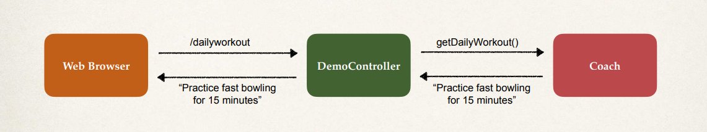

# Constructor Injection

Now just to continue, let's look at another example application here. 



So we have our **Web Browser**, we have the `DemoController` and then we have a `Coach`. 

So on our Web Browser we'll go to this endpoint `/dailyworkout`. Our DemoController will communicate with the `Coach` that says, "hey, getDailyWorkout" by calling that method. That method's gonna return a string, "Practice fast bowling for 15 minutes", and then we'll simply return that to the browser. So that's kind of the big picture here. This example that we want to put together. Now here's the development process using **Constructor Injection**.

## Step 1: Define the Dependency Interface and Class

Defining the dependency **interface** and **class**. So we'll have this interface called `Coach`. It has a method `getDailyWorkout()`, and then we'll have a `CricketCoach` that implements `Coach`. And it has this method, `getDailyWorkout()`, that returns the String, "Practice fast bowling for 15 minutes". For clarity, they should be in a package, say `sport`.

```Java Coach.java
public interface Coach {
    
    public String getDailyWorkout();
}
```

```Java CricketCoach.java
@Component
public class CricketCoach implements Coach {
    
    public String getDailyWorkout() {
        return "Practice fast bowling for 15 minutes";
    }
}
```

Now notice here that this class has the `@Component` annotation. So this marks the class as a **Spring Bean and makes it a candidate for dependency injection**.

### **`@Component` Annotation**

Now a bit more here on the `@Component` annotation. 

It marks the class as a Spring Bean. So a **Spring Bean** is just a regular Java class that's managed by Spring. And the `@Component` annotation also makes the bean available for dependency injection. 

## Step 2: Create our REST Controller

Now step two of creating a Demo REST Controller. We create this `DemoController`, we give it the `@RestController` annotation, very basic REST example here. 

```Java DemoController
@RestController
public class DemoController {


}
```

### **Create a Constructor in our Class for Injections**

We create the constructor in our class for injections. So we define a private field here, `myCoach`, and then we create this constructor, `DemoController`. We pass in, `Coach theCoach`, and then we make use of the `@Autowired` annotation. 

```Java
@RestController
public class DemoController {

    // field for the dependency
    private Coach myCoach;

    // the constructor for dependency injection
    @AutoWired
    public DemoController(Coach theCoach) {
        myCoach = theCoach;
    }
}
```

And so remember the Spring Object Factory will handle injecting this dependency based on the configuration. And notice the `@Autowired` annotation tells Spring to inject the dependency. Common-sensically, if you only have one constructor, then the `@Autowired` annotation on the constructor is optional. But I'll keep it here, just for academic purposes. And then at the moment, we only have one `Coach` implementation, `CricketCoach`. So Spring can figure out which one it needs. Later in the course we'll cover the case of multiple `Coach` implementations and we'll see how to configure your application accordingly. 

### **Map the Endpoint**

To map the endpoint, we're going to add the `@GetMapping` for `/dailyworkout`. So in our coding here at the bottom notice we have this `@GetMapping("/dailyworkout")`. So that's the REST endpoint they'll use.


```java DemoController
@RestController
public class DemoController {

    Coach coach;
    @Autowired
    public DemoController(Coach theCoach) {

        coach = theCoach;
    }

    @GetMapping("/dailyworkout")
    public String getTheDailyWorkoutForCoach() {

        return coach.getDailyWorkout();
    }
}
```

We'll basically say `return myCoach.getDailyWorkout()` and it will return that as a string. And so remember you're kinda pulling this all together with the Web Browser; they go to `/dailyworkout`. We talk to this `DemoController` which in turn talks to the `Coach`, gets the daily workout, then returns that value accordingly to the application. 

Alrighty, so this all looks pretty good. Let's go ahead and move inside the IDE and start writing this code and start writing our first Spring project.
