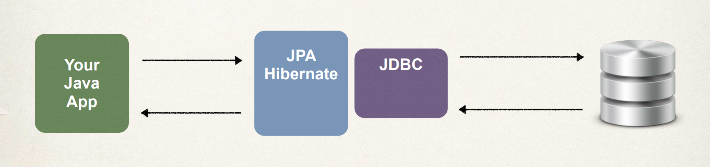

# JPA and JDBC 

How does Hibernate/JPA relate to JDBC? **Hibernate-JPA** actually uses **JDBC** for all database communications. **Hibernate-JPA is just another layer of abstraction on top of JDBC**. 

So when your application uses the Hibernate-JPA framework, your app will actually store and retrieve the objects using the JPA API. Hibernate-JPA does a lot of the low-level work for you, but in the background, it all goes through the standard JDBC API. 

Hibernate-JPA is configured to talk to the database, using a JDBC driver and we'll cover all the technical details of that. So, just to give you a heads up and summary, Hibernate-JPA makes use of JDBC in the background for communicating with the database.
