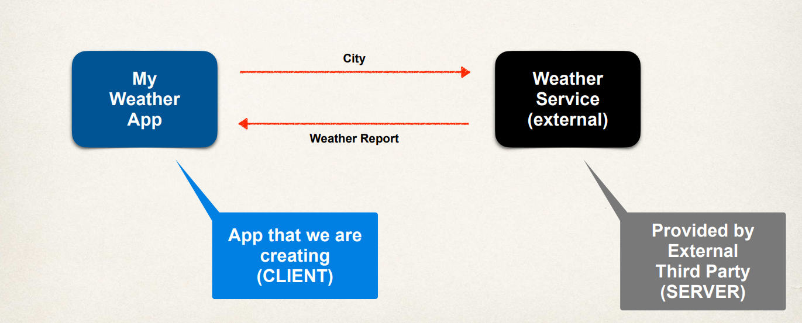

# Overview 

Let's go ahead and set up a **Spring REST Hello World example**. So we'll have the REST client, we'll also have the REST service. Now what we'll do is we'll basically make a request for a `/test/hello`. This REST service will respond with **Hello World!** 
 
 

On the server side we'll write the code here for the REST service. As for the REST client, we can make use of either the web browser or we can make use of Postman.

## Spring REST Controller 

So here's the basic coding here for a Spring REST controller. So this looks like a normal **Spring MVC controller**. We're making use of the `@RestController`, that adds the support for REST. So then in the actual code we simply set up an `@GetMapping`. We write our method that simply returns "Hello World!". 

```Java
@RestController
@RequestMapping("/test")
public class DemoRestController {
	@GetMapping("/hello")
	public String sayHello() {
		return "Hello World!";
	}
}
```

Basically at this point we've defined this **RESTful endpoint**. We can access this REST endpoint by simply going to `/test/hello`. And now this will actually return "Hello World" back to the actual calling program. 

## Test With REST Client 

Now, let's talk about clients here. So, we can test this with the **REST client using Postman**. In Postman we simply drop in the URL here: `https://localhost:8080/<app-name>/test/hello`. So that'll access the REST endpoint and we will get the response. 

We could also do a similar thing with the web browser. So in the web browser you can simply drop in the URL here `https://localhost:8080/test/hello` and it'll return the response.   

## Postman vs Web Browser 

Well, for simple REST testing for `GET` requests, the web browser and Postman are similar. However, for advanced REST testing, like using `POST` or `PUT`, etc, then Postman has much better support. For example, if you need to post JSON data, set the content type, pass over request headers, do authentication, then it's much easier to do this using Postman. So Postman is really designed out of the box as a REST client testing tool. Postman has a lot of rich support. For the simple stuff you can use the browser, but for really advanced development you'll need to use Postman. 
