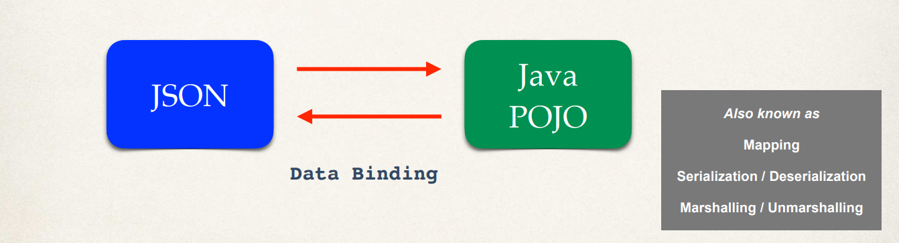

# Overview 

## Java-JSON Data Binding 
 
Data binding is the process of converting JSON data to a Java POJO (Plain Old Java Object). Spring will read the contents of that JSON file and then populate the Java object with that given data. Or you can go the other way. You can start with the Java POJO and then send it down to an actual JSON string or JSON file. Now this whole process is called **data binding** (or **mapping**, **sterilization**, **desterilization**, **marshalling**, **unmarshalling**). It's just basically converting from one format to another. 

## Java-JSON Data Binding with Jackson 

Jackson Project handles the data binding between JSON and the Java POJO. So Jackson is actually a separate project. There's a lot of synergy between Jackson and Spring but Jackson's a separate project for doing data binding. Jackson has support for doing data binding with XML, JSON, and so on. So it's a very popular project. 

### **Jackson Data Binding**

Now, by default, Jackson will call the appropriate getter and setter methods when it handles the conversions. So if you're converting from JSON to POJO it'll call up given setter methods. When you go from POJO to JSON it'll call the getter methods. And so Jackson will actually do all of this work for you behind the scenes once we get everything set up. And we'll cover all the coding for setting this up. 

## Spring and Jackson Support 

So when you're building Spring REST applications, Spring will automatically handle the Jackson integration. So any JSON data that's being passed to the REST controller is automatically converted to a POJO. And also any Java object that's being returned from a REST controller is converted to JSON using the Jackson project. And again, all of this happens automatically behind the scenes. Thanks to the integration between Spring and Jackson. 
