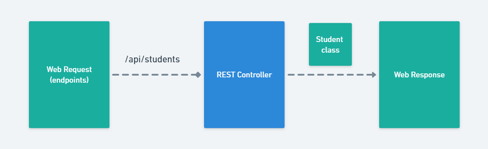
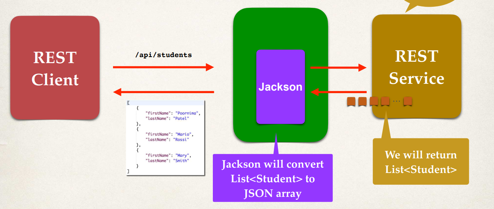
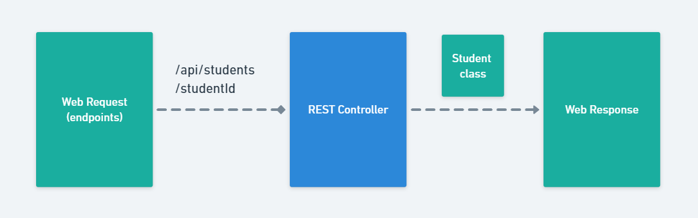

# Java-POJO 

We're going to create a spring rest service for students that is going to return a list of students. 

## Create a New Service 

So basically we'll send over a `GET` request to `api/students`, and this is going to return a list of students for us. Let's look at the big picture here. 

 

We'll have our **REST client**, and then over on the right hand side, we'll have our **REST service**. We'll access this request mapping, `api/students` making a `GET` request and then this will return a list of students as JSON. And then, we'll write the code for the service. And for the client, we can make use of any client in this example, a web browser or a postman. 

### **Spring REST Service Behind the Scenes**

Let's see how this works behind the scenes. So here we have our REST client and our REST service. We make a request of `college/students`. 

 

So spring REST and Jackson are going to work together. So any request coming in if there are any JSON data, they will be converted into POJOs. Well on our REST Service we'll create a **list of objects** or a list of students and we'll return those items. So then Jackson will actually handle converting that list of students to the **JSON array**. 

### **Path Variables**

We're going to use spring REST with **path variables**. And to help us out with path variables, we'll have this new endpoint to retrieve a single student by the ID. So we'll make a `GET` request to `/college/student/studentId`, and this will retrieve a single student. Such that when we actually access it via our REST client, we can include an actual value there. 

 

So we could say `/college/student/1`, that'll give us the student with ID `1`. So, it's basically a way of parameterizing your path or the endpoint to actually accept data. Now again, we'll actually write the code here for the REST service. 

## Development Process 

So let's look at our development process: 

  1. Create a Java POJO class `Student` 
  2. Create a Spring REST service using that `@RestController` annotation and use necessary path variables using the `@PathVariable` annotation. 

## REST Controller

What we need to do is actually go through and create our REST controller. 

So, I'll create a `rest` package and create a new class for our REST controller, `@StudentRESTController`. Here's the basic layout here for our student REST controller. 

```Java StudentRESTController.java
...

@RestController
@RequestMapping("/college")
public class CollegeController {

    /*
     * The fields
     */
    StudentDAOImpl studentDAO;

    /**
     *
     * @param studentDAO
     */
    public CollegeController(StudentDAOImpl studentDAO) {
        this.studentDAO = studentDAO;
    }

    /**
     *
     * @return a list of students
     */
    @GetMapping("/students")
    public ResponseEntity<List<Student>> getStudents() {
        List<Student> students = studentDAO.findAll();
        return new ResponseEntity<>(students, HttpStatus.OK);
    }
}
```

So we have the annotations up top for the `@RESTController` and `@RequestMapping`. We simply define a get mapping, `@GetMapping`. We'll return a list of all of the students that we have. We have created some sample students in this method that we will return back to the calling program using an array. And for now, we'll just hard code it. We'll get into all the database stuff later. 

So that's the endpoint here and we can access this endpoint by going to `/api/students`. And remember, Spring will make use of Jackson in the background. It'll take those POJOs and convert them to JSON. 

We don't have a `Student` class yet, let's create one. 

## Application Testing 

We can go ahead and test out the endpoint using the web browser or Postman.
