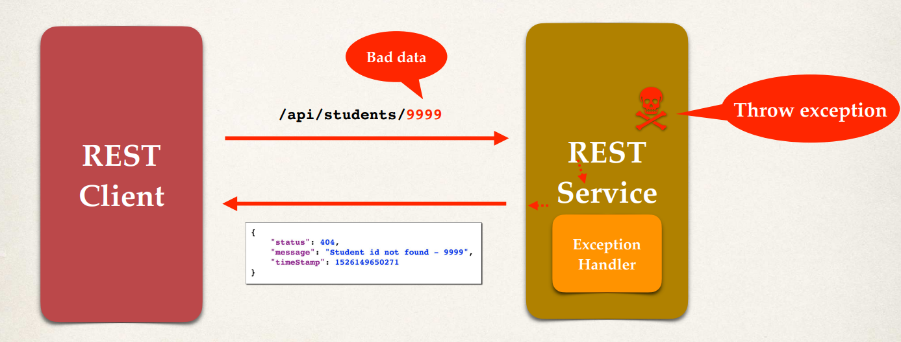

# Exception Handling Overview 

Remember our problem when we input 999 in the endpoint. We got this ugly exception, `500 Internal Server Error`. The root cause was an index out of bound. We really want to handle the exception and return the error as JSON. 

So we'd like to have a nice little JSON message come back that has the details on the error or the exception. So we'd like to give the actual status code of `404`, the actual error message, and then maybe a timestamp as for when this given error occurred. 

```Json
{
	"status": 404,
	"message": "Student ID not found - 999",
	"timeStamp": 1758673459086
}
```

### **Spring REST Exception Handling**

Let's look at the big picture here. So we have this REST Client and the REST Service. We make a call for `/college/student/999`. That's the bad data. It makes it into our REST Service then throws an exception, and then we'd like to actually handle for that exception. Then instead of that ugly HTML page, we'll send back the exception error message as JSON. But not just ordinary JSON. We want to let the browser know that inherently the response is not the right response to get. We will reference the faults and the consequence (bad request). 

 

## The Development Process 

Let's look at the actual development process here. 

  1. Create a custom error response class. 
  2. Then we'll actually create a custom exception class. 
  3. Update our REST service to throw the exception if the student is not found. 
  4. Add an exception-handler method using the `@ExceptionHandler` annotation. 

## Custom Error Response Class

So we'll start with step one of creating our custom error response class. This class, `StudentErrorResponse` will be in a package, say `rest`. 

Remember, this is just a POJO and we'll simply define the fields here for: `status`, `message`, and `timestamp`. 

```Java StudentErrorResponse.java
public class StudentErrorResponse {
    private int status;
    private String message;
    private long timeStamp;

    // Constructor
    public StudentErrorResponse() {
    
    }

    public StudentErrorResponse(int status, String message, long timeStamp) {
        this.status = status;
        this.message = message;
        this.timeStamp = timeStamp;
    }

    // Getters and Setters
}
```

We've simply gone through and defined the constructors for it. We have the two constructors, getters and setters, and the fields. 


## Custom Exception Class 

So with step two is simply creating a custom exception class for this example. And so again in our rest package, we'll create this class, `StudentNotFoundException` which extends the `RuntimeException`. 

```Java StudentNotFoundException.java
public class StudentNotFoundException extends RuntimeException {

    public StudentNotFoundException(String message) {
        super(message);
    }

    public StudentNotFoundException(String message, Throwable cause) {
        super(message, cause);
    }

    public StudentNotFoundException(Throwable cause) {
        super(cause);
    }
}
```

We have generated the constructor from the `super` class. Those are the three that we want. We may not use all of them but it's just good to have them in case we need to use them again in the future. 

That's the `StudentNotFoundException` and we can use this in the REST Service when it's actually time to **throw an exception**. If the student-ID is a bad student-ID or I can't find the given student. All right, so that's our custom student exception. So that takes care of step two.

## REST Controller

```java
@RestController
@RequestMapping("/college")
public class CollegeController {
    ...

    @GetMapping("/student/{studentId}")
    public ResponseEntity<?> getStudent(@PathVariable Long studentId) {
        Student student = null;
        try {
            student = studentDAO.findById(studentId);
            if (student == null) {
                throw new StudentNotFoundException("The student with the input id does not exist");
            }
        }
        catch (StudentNotFoundException e) {
            StudentErrorResponse error = new StudentErrorResponse();
            error.setStatus(HttpStatus.NOT_FOUND.value());
            error.setMessage(e.getMessage());
            error.setTimeStamp(System.currentTimeMillis());
            return new ResponseEntity<>(error, HttpStatus.BAD_REQUEST);
        }
        return new ResponseEntity<>(student, HttpStatus.OK);
    }
}
```

In the `getStudent()` method is where we will add some logic to check the student ID. And then if everything's okay, we make it past that `if` statement, then we simply return the students.
