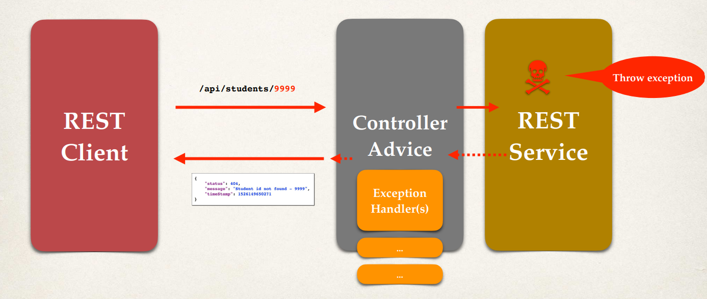

# Global Exception 

We will cover Spring REST Global Exception Handling. 

Now, in the previous lessons, we added code for exception handling. Inside of the REST service, we had an exception handler that'll actually pass back the exception as JSON data. That coding works but the exception handler code is only for the specific REST controller. The coding can't be reused by other controllers. And on large projects, or on realtime projects, you'll normally have multiple REST controllers. So ideally, what we need is global exception handlers. 

So this promotes the idea of reuseability, and also helps you centralize your exception handling, and minimizes the amount of code that you need to duplicate across multiple controllers on very large projects. 

So to help solve this, we can make use of this Spring `@ControllerAdvice` (similar to an interceptor or filter). 

So now, with this Spring REST exception handler, `@ControllerAdvice`, we have our REST client, our REST service, we make a request across to the actual service. 

 

We'll have this controller advice to **pre-process** the request, and then the REST service will execute. If there is something wrong, we'll throw an exception. 

The exception handler(s) are going to be moved out and placed in the controller advice. So this will give us support for global exception handling. 

As for the development process: 

  1. Create a new controller advice, 
  2. Refactor our REST service, and 
  3. Add the exception handling code to the controller advice.

## Controller Advice

We create this new class `StudentRestExceptionHandler` and we'll take the exception handler methods to the controller advice class. 

```Java
@ControllerAdvice
public class StudentRestExceptionHandler {

    // add exception handling code here

    // add exception handling code here
    @ExceptionHandler
    public ResponseEntity<StudentErrorResponse> handleException(StudentNotFoundException exc) {
        // create a StudentErrorResponse
        StudentErrorResponse error = new StudentErrorResponse();
        error.setStatus(HttpStatus.NOT_FOUND.value());
        error.setMessage(exc.getMessage());
        error.setTimeStamp(System.currentTimeMillis());
        // return ResponseEntity
        return new ResponseEntity<>(error, HttpStatus.NOT_FOUND);
    }

    // add another exception handler ... to catch any exception (catch all)
    @ExceptionHandler
    public ResponseEntity<StudentErrorResponse> handleException(Exception exc) {
        // create a StudentErrorResponse
        StudentErrorResponse error = new StudentErrorResponse();
        error.setStatus(HttpStatus.BAD_REQUEST.value());
        error.setMessage(exc.getMessage());
        error.setTimeStamp(System.currentTimeMillis());
        // return ResponseEntity
        return new ResponseEntity<>(error, HttpStatus.BAD_REQUEST);
    }
}
```

We have added the `@ControllerAdvice`, a special annotation from the spring framework.

So here's the first exception handler that we had for just handling for a student-not-found exception. And then the other one that we have is our catch-all for handling any type of exception.
