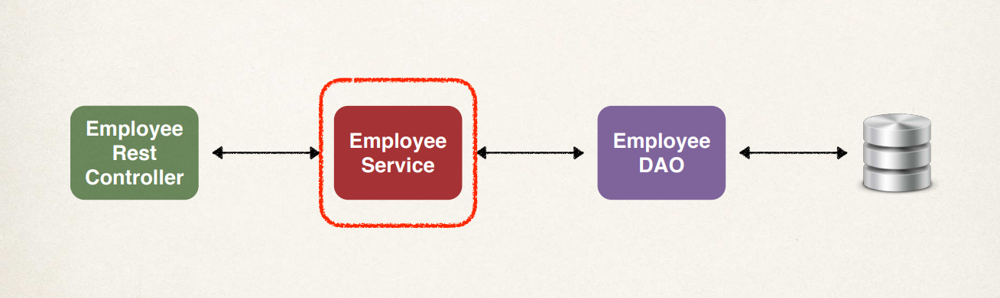
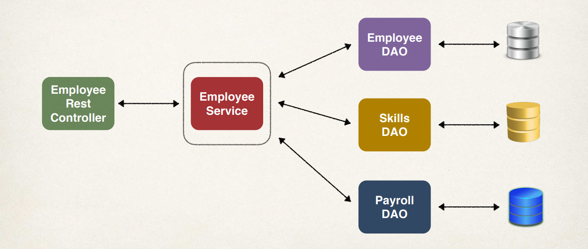

# Spring Boot Services Layer 

We're going to add a service layer using the `@Service` annotation. This service layer will actually sit between our employee controller and our employee DAO. 

 

Now, you may wonder, what's the purpose of the service layer? Well, it's actually an implementation of the **service facade** design pattern. It's an intermediate layer for your custom business logic, and you can also use it to integrate data from multiple sources. 
 
Now, here's an example of integrating data from multiple sources. Say, for example in the diagram below, we have our Employee Service and we need to pull in data about an employee from different types of data sources. We'll make use of the `employeeDAO`, which gives us the basic information, like the first name, last name, email address, and so on. We also may need to get a list of skills for an employee. We can make use of the `skillsDAO`. And then finally, at the bottom, we need to make use of the `payrollDAO` to retrieve salary information for an employee. And then, we'll integrate all of this together, so that we can give the controller a single view of all the data that we've integrated and pulled together. 

 

Now, Spring provides the `@Service` annotation as a sub-annotation to `@Component`. It's a specialized annotation for services. Let's look at the development process for building up employee service: 

1. Define the `Service` interface
2. Define the `Service` implementation 
   - Inject the employee DAO. 

## The Service Interface 

The first thing we want to do is create a new package for the service, `/service`. Now let's go ahead and create a new interface in this package, `EmployeeService`. 

```Java EmployeeService.java
public interface EmployeeService {

    void save(Employee employee);

    List<Employee> findAll();

    Employee findById(Long employeeId);

    Employee update(Employee employee);

    void delete(Long employeeId);
}
```

These are pretty much the same methods that we wrote at the DAO layer. 

## The Service Implementation 

Okay, so let's go ahead and swing over and create a new class for our service impl. 

```Java EmployeeServiceImpl.java
@Service
public class EmployeeServiceImpl implements EmployeeService {

    EmployeeDAO employeeDAO;

    /**
     *
     * @param employeeDAO
     * @return
     */
    public EmployeeServiceImpl(EmployeeDAO employeeDAO) {
        this.employeeDAO = employeeDAO;
    }

    @Override
    public void save(Employee employee) {
        employeeDAO.save(employee);
    }

    @Override
    public List<Employee> findAll() {
        return employeeDAO.findAll();
    }

    @Override
    public Employee findById(Long employeeId) {
        return employeeDAO.findById(employeeId);
    }

    @Override
    public Employee update(Employee employee) {
        return employeeDAO.update(employee);
    }

    @Override
    public void delete(Long employeeId) {
        employeeDAO.delete(employeeId);
    }
}
```

## The REST Controller 

So, we're basically calling the same methods on the given DAO. So now our rest controller is going to make use of our employees service, and we already know behind the scenes, our service actually delegates the calls to the DAO.

The `@RequestBody` annotation tells Spring to bind the request body to the `Employee` object.

