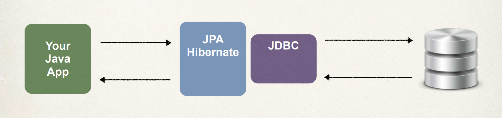

# Hibernate 

This note gives an overview of **Hibernate** and **JPA**. What is Hibernate and the benefits of using Hibernate? What is JPA and the benefits of using JPA? we will make use of JPA in our application.

## Hibernate 

Hibernate is a framework for persisting (saving) Java objects into a database. It is used by a lot of enterprise Java projects. Basically, your Java application will make use of Hibernate for saving and retrieving data from the database. What are the benefits of using Hibernate? 

  1. Hibernate handles all of the low level SQL code. It minimizes the amount of JDBC code that you have to develop. 
  2. Hibernate can handle the Object-to-Relational Mapping (ORM), and 
  3. It is easy to use **to create apps to store and retrieve objects from the database**. 

Hibernate provides something called the Object-to-Relational Mapping (ORM). As a developer, all you need to do is tell Hibernate how your Java class or object maps to the data in the database. 
 
In this example, we have our Java class, `Student`, it has four fields: `id` (which is the primary key), `firstName`, `lastName`, and `email`. We have the Hibernate framework in the middle. On the far right is the actual database table. 



What happened here is that this Java class is mapped to the table. You can set up this mapping via a configuration file using **XML**, or using **Java annotations**. We will make use of Java annotations in this course.
 
## JPA 

**JPA** is the **Jakarta Persistence API**, previously known as the *Java Persistence API*. It's the standard API for Object-to-Relational Mapping. It's only a specification that defines a set of interfaces, and it requires an implementation to be usable. 

Now let's take a look at some JPA vendor implementations. So we start with the **JPA Spec**, it's just a list of interfaces, and we will need to implement this interfaces. Two common implementations are: **Hibernate**, and **EclipseLink**. They have their own implementations of the JPA specification. Just like with Java coding, they take those interfaces and they provide an implementation of those given interfaces. There are other JPA vendors out there. 

**Hibernate** is probably the most popular implementation of the JPA specification, and it's also the default implementation used in Spring Boot. Following are the benefits of using JPA? 

  1. By having a standard API you're not locked into the vendor's implementation. 
  2. You can maintain portable and flexible code by simply coding to the JPA spec or the interfaces. 
  3. Theoretically, you can switch vendor implementations. For example, if vendor ABC stops supporting their product, then you could switch to vendor XYZ without any vendor lock-in. And the reason for this is because you're coding to the actual JPA specification or the standard API. 

## Java Object and JPA 

This is a quick example on how to save a Java object with JPA. The first thing we do is, from its class, we create the Java object, `theStudent` with basic Java and use the necessary arguments. Then we save this object to the database, and so here we make use of the `entityManager`, which is a special JPA helper object. We pass in our object into the method `persist`. 

```Java
// create Java object 
Student theStudent = new Student("Paul", "Doe", "paul@opf.com") 

// save it to the database 
entityManager.persist(theStudent); 
```

And what happens in the background is that JPA will take the Java object based on those mappings that we defined earlier, and take that information and store it in the appropriate table and in the appropriate columns. Hibernate is an implementation of JPA, it would do all the work for you. 

In the old days of **JDBC**, you would have to manually write the SQL code, set values, execute, and so on. But using JPA, with the help of Hibernate, all the work is done for you in the background. 

Now that we have something in the database, how do we retrieve it? Well, there's a number of different options on how to retrieve objects, but I'll show you here a very basic example by making use of the primary key. 

```Java
// create Java object 
Student theStudent = new Student("Paul", "Doe", "paul@opf.com") 

// save it to the database 
entityManager.persist(theStudent); 

// now retrieve from database using the primary key
int theId = 1; 
Student myStudent = entityManager.find(Student.class, theId); 
```

And in this example I know that our database was empty and we knew that the first item will have the primary key of 1, so I can use this ID. I'll show you other techniques on how to retrieve objects later. Here, I'll make use of this `entityManager.find`, and I tell it what I want to get, a `Student.class`, and I give the **id** or the primary key. Behind the scenes JPA will look for the table called **student**, and find the student whose primary key matches the **id** and returns it to us. And that's basically how we retrieve a Java object from the database.

Let's look at a scenario where you want to retrive all the students. We can set up a query and get all of the students. JPA has a language for queries. We will use the `entityManager.createQuery` method. We will pass `Student.class` into it. And it'll give us a list of all of those student objects. And then we can retrieve those objects from the query by using the `theQuery.getResultList()` method. The method return a `TypedQuery`.

```Java
TypedQuery<Student> theQuery = entityManager.createQuery("from student", Student.class);

List<Student> students = theQuery.getResultList(); 
```

So behind the scenes it'll do the query for us, give us a list of objects and then return it, and we can make use of the objects. 

And so here we made use of a very basic query called the **JPA Query Language**, and we'll talk more about this in later lessons. It allows you to query the objects from a given database. And you can also set up special `WHERE` clauses using conditions, and so on.
