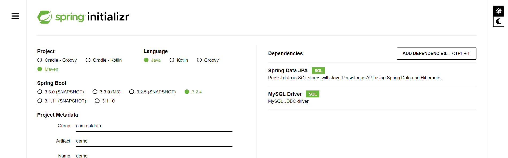

# Project Set-up

Let's get started with creating our Spring Boot project. So on the web browser, let's go to the Spring Initializr website, `start.spring.io`. At the website, we will do the normal things. Now, the new thing is that we will add a new dependency here for the **MySQL driver** and **Spring Data JPA**. All right, and just as a checkpoint, make sure you have these two dependencies. Let's go ahead and click on **Generate** and get this project created for us and download it to our system. 

 

as I have shown here on the screen. All right, let's go ahead and click on **Generate** and get this project created for us and download it to our system. I'll unzip it and then I'll move to my `dev-spring-boot` directory. I'll move into this `03-spring-boot-hibernate-jpa-crud`. And in this folder here, I'll save my project folder named, `01-cruddemo-student`.
