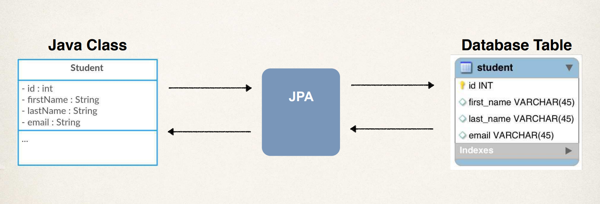

# Overview 

Hibernate is the default JPA implementation in Spring Boot. Going forward we'll simply use the term **JPA** instead of saying **JPA-Hibernate** or **Hibernate-JPA**.

For terminology, we have this term called **Entity Class**, **the Java class that is mapped to a database table using ORM**. We'll have this Java class called `Student` that has four fields: `id`, `firstName`, `lastName`, and `email`, we'll make use of JPA, and we'll map it to a given database table called `student` that has four columns: `id`, `first_name`, `last_name`, and `email`. 

At a minimum, the `Entity` class must be annotated with the `@Entity` annotation. Also, it must have a `public` or `protected` no-argument constructor. The class can have other constructors, but again, as a minimum, you must have a `public` or `protected` no-arg constructor. 

We have two steps here: 

  1. One is mapping the class to a database table, and then 
  2. Mapping the fields to database columns. 

## Map Class to Database Table 

Let's get started here with step one of mapping a class to a database table. So we have this class `Student`, we have this database table called `student` in the database.

```sql
CREATE TABLE `student` (
  `id` int NOT NULL AUTO_INCREMENT,
  `first_name`varchar(45) DEFAULT NULL,
  `last_name` varchar(45) DEFAULT NULL,
  `email` varchar(45) DEFAULT NULL,
  PRIMARY KEY (`id`)
);
```

What JPA does is map the above table to a Java POJO using ORM.



Here, I make use of this `@Entity` annotation for my class. 

```Java Student.java 
@Entity
@Table(name="student")
public class Student {
	...
}
```

And then I make use of the `@Table` annotation, and I gave the `name = student`. That's the name of the database table that we're actually mapping this given Java class to. 

## Map the Fields to Database Columns 

And then in the next step, we map fields to database columns. Here we have this class `Student` with the following fields. 

```Java Student.java 
@Entity
@Table(name="student")
public class Student {
	
	// student ID 
	private int id;

	// first name 
	private String firstName; 

	// last name 
	private String lastName; 

}
```

We need to map these given fields to the appropriate database columns. And I can do that by making use of the `@Column` annotation. 

```Java Student.java 
@Entity
@Table(name="student")
public class Student {
	
	@Id
	@Column(name="id")
	private int id;

	@Column(name="first_name")
	private String firstName;

	...

}
```

So again, notice here the spelling. There's different spellings here between the Java class and the actual database column name, and we annotate those accordingly. One thing to be aware of here is that the `@Column` and `@Table` annotations are optional. So if not specified, they pick the names as the Java names.

### **Primary Key**

Here's another term here, the **Primary key**. So the primary key uniquely identifies each row in a table. It must be a unique value, and it cannot contain null values. 

### **MySQL - Auto Increment**

In the MySQL database, we can make use of a keyword, **auto increment**. So we can define our primary key, and then we can specify that it's an auto increment. So here, I have a little snippet here: 

```SQL
CREATE TABLE student (
	id int NOT NULL AUTO_INCREMENT,
	first_name varchar(45) DEFAULT NULL,
	last_name varchar(45) DEFAULT NULL,
	email varchar(45) DEFAULT NULL,
	PRIMARY KEY (id)
)
```

We have this column `id`, and then we specify `AUTO_INCREMENT`. Behind the scenes, MySQL will keep track of automatically incrementing this ID, and making sure it's a unique value. And also here, the line at the bottom, `PRIMARY KEY (id)` specifies that our given column `id` is the primary key for this given table. 

Consequently, in the JPA world, we have to specify the actual primary key or the identity here. So we make use of the `@Id` annotation, and then we specify how this given ID or primary key value is generated. 

```Java
@Entity
@Table(name="student")
public class Student {
	@Id
	@GeneratedValue(strategy=GenerationType.IDENTITY)
	@Column(name="id")
	private int id;

	...

}
```

This `id` value will be generated by the database and managed by the database. There's no need for our code to manually try and keep track of that given id. 

Now, a bit more here on the ID generation strategies. 

  1. `AUTO`: It'll basically pick an appropriate strategy for the particular database. 
  2. `IDENTITY`: That's the one that we're using. So we're gonna assign primary keys using the database identity column or primary key column. 
  3. `SEQUENCE`: You can assign primary keys using a database sequence. 
  4. `TABLE`: You'll assign primary keys using a database table to ensure uniqueness. 

In general, the type `IDENTITY` is recommended. It should cover most of the use cases. However, if you have very specific use cases, you can apply some of the other generation types based on your application requirements. 

### **Override Generation Type**

Due to preference, you may have a very specific requirement for generating the id. And unfortunately, nothing that JPA provides out of the box matches your requirement. No problem. You can actually define your own custom generation strategy for generating your id. 

You simply create a custom implementation of this `org.hibernate.id.IdentifierGenerator` interface. You override the method or implement the method `public Serializable generate()`. And again, inside of this `generate()` method, you provide your own custom business logic for generating a given id. So they basically give you an extension point where you can create your own custom generation strategy for creating your IDs. Alrighty, this all looks pretty good.
