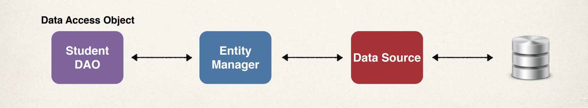
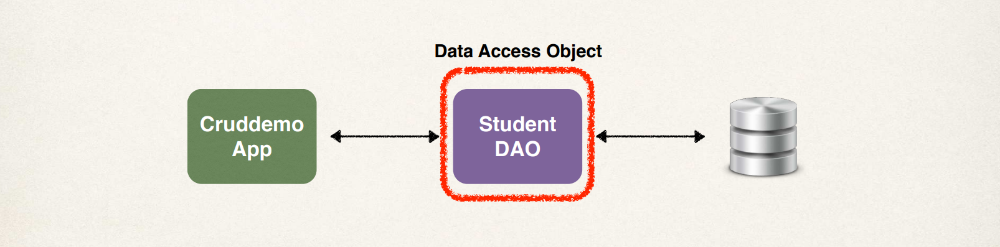
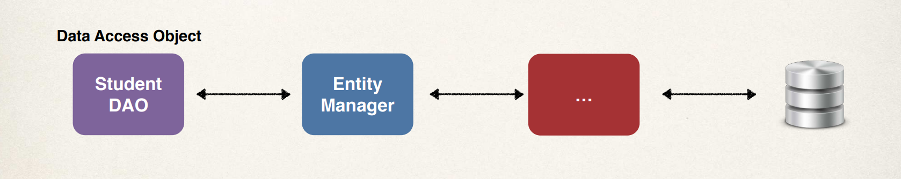

# JPA CRUD 

We'll create a sample application, and these are the features of the application: **Create** a new student; **Read** a student; **Update** a student; and also **Delete** a student. This is basically a **CRUD** application.

## Entity Manager 

Based on information from our Maven POM file, and also information from our `application.properties` such as the URL, user ID, and password, our application will connect to the database, and then we can autowire or inject the JPA `EntityManager` into our `StudentDAO`.

 

Our **Entity Manager** will have a number of methods. I have sectioned them into a way to imagine them as CRUD methods: 

  1. Create/Update 
     1. `merge(Object entity)` 
     2. `persist(Object entity)`

  2. Read 
     1. `find(Class<T> entityClass, Object primaryKey)` 
     2. `createQuery(String qlString, Object entity)`

  3. Delete 
     1. `remove(Object entity)` 
     2. `flush()` 
     3. `clear()` 

## Data Access Object 
 
We'll make use of a **Student Data Access Object (DAO)**, a very common design pattern which is **responsible for interfacing with the database through the Entity Manager**.

 

Here, **our application communicate with the DAO, and the DAO will talk to our actual database**. We can say the DAO is like a helper class for communicating with the database.

We will have a number of methods in the **Student Data Access Object** to perform CRUD operations.Conceptually and logically, these methods are determined by what the Entity Manager can do. **The Entity Manager methods that are avaialble will determine what we can implement in the DAO**.

  1. Create
     1. `save()`: for saving a student

  2. Read 
     1. `findById()`: for finding by ID 
     2. `findAll()`: find all 
     3. `findByLastName()`: find by last name

  3. Update 
     1. `update()`: for updating the student

  4. Delete 
     1. `delete()`: for deleting student 
     2. `deleteAll()`: for deleting all students. 

In our scenario, our Data Access Object needs a **JPA EntityManager** which is **the main component for saving and retrieving entities**. So we have our student DAO here which is going to make use of an **Entity Manager** that also has some other supporting components communicating with the actual database. As for the other supporting components, our JPA `EntityManager` needs a **data source**. So the data source basically defines the database connection information, and **the JPA `EntityManager` and the data source are automatically created by Spring Boot**. 

 

## What about JpaRepository? 

Let's take a small digression for a second. Some of us may have read about **JpaRepository**. And at this point in the course, you may wonder, why we are not using **JpaRepository** instead of using **Entitymanager**? So just a bit of context here, Spring Data JPA has a **JpaRepository** interface. It provides JPA database access with minimal coding. We will use JpaRepository in this course. We'll cover it later in the course. And in this course, we will see the various techniques for using JPA, and this will help you on future projects. 

Now as for when to use which, in very simple terms, if you need low-level control and flexibility, **use EntityManager**. If you want a high level of abstraction, then make **use of JpaRepository**. Now let's dig into this a bit and talk more about these use cases here. Starting here with EntityManager. 

  1. EntityManager is useful when you need low-level control over the database operations, and you wanna write custom queries. 
  2. EntityManager also provides low-level access to JPA, and allows you to work directly with JPA entities. And you can use this for a complex queries that require advanced features such as native SQL queries or stored procedure calls. 
  3. And also, EntityManager is great when you have customer requirements that are not easily handled by higher level abstractions. 

Now the use case for JpaRepository is that: 

  1. It provides commonly used CRUD operations out of the box. This reduces the amount of code that you need to write. 
  2. It also has additional features such as pagination and sorting. It can also generate queries based on Java method names. And you can also create custom queries using the query annotation. 

My recommendation is that the choice really depends on your application requirements and developer preference, but one thing I'd like to point out is that you can actually use both of these in the same project. You wanna leverage the different features of each one. Now for learning purposes, I recommend that you start by learning EntityManager first, then learn JpaRepository. Because, basically, this will help you learn the low-level coding behind the scenes. And then you can use JpaRepository for some of the more additional features there.
