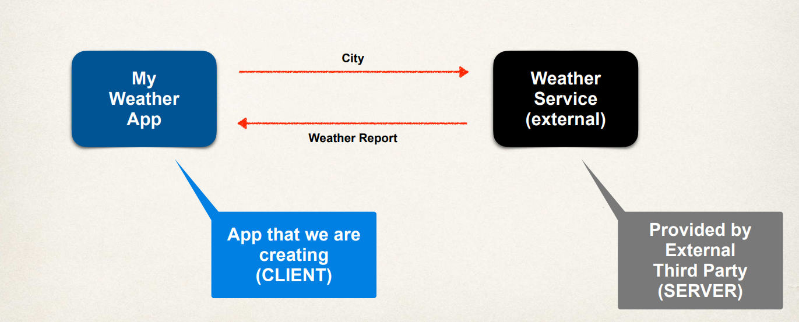

# REST API - REST Web Services

## Practical Results 

Now the main focus here is on practical results. This is an introduction to Spring Rest Development. The important thing here is that it's not an A to Z reference for that. You can see the Spring Reference Manual. 

## Business Problem - The Weather Application 

So let's look at the business problem. What are we trying to solve? So we want to build a client application to provide the weather report for a city. We need to get the weather data from an external service, because we don't have a local database of weather information, it changes all the time. 
 
### **Application Architecture**

Looking at the application architecture, we'll have **My Weather app**, the app we're creating, and then we'll have the **weather service**. The weather service is an external service that's provided by some third party. So that's like the backend server. 

 

What we'll do with our weather app is that we'll simply pass over a string for the city and then this weather service will return back with the actual weather report. 

### **Connection** 

How are we to connect to the weather service? Well, we can make REST API calls over HTTP. **REST** stands for the **Representational State transfer**. It's a lightweight approach for communicating between applications. 

### Programming Language 

What programming language do we use? REST is language independent. So the client application can use any programming language and the server application can use any programming language. So it's totally up to you which language that you'll use for your application. This gives us flexibility on the actual implementation on the client side and also on the server side.

### **Data Format** 

What is the data format? REST applications can use any data format. You'll commonly see **XML** and **JSON**. With JSON being the most popular because it's modern. **JSON** stands for the **JavaScript Object Notation**. We'll see a small example of JSON, and then we will talk a bit more about the JSON syntax.

### **Possible Solution** 

So a possible solutions that we can use is the `openweathermap.org`. They have a weather API that you can use. They also give documentation on how to use it. The data on `openweathermap.org` is available in JSON, XML or HTML format. The API documentation gives you some information on how to use it.

So you can go to `openweathermap.org`. For example, you can pass in the *city name*, or you can pass in the actual *city name*, *country code*, because you may have common city name, and then you'll actually get the response, the weather report, in JSON. The JSON is a collection of **name-value pairs**, with the weather properties' names and their respective values. And then your application can parse this string and then process on it accordingly.
