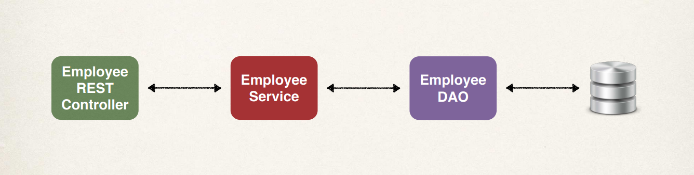

# Overview 

For REST API design, when building a real-time project we need to wonder who will use our API, and how they will use our API. And then we need to design the API based on these requirements. 

Let's look at the API design process, as RIU: 

  1. Reviewing the API requirements, 
  2. Identify the main resource or entity, 
  3. Use the HTTP methods to assign the action on a given resource. 

### **Reviewing the API requirements**

Say we received an email from the boss, and it says, "Create a REST API for our Employee Directory system." 

Basically, what we would like to do is: 

  1. Allow the REST clients to get a list of employees, 
  2. They can also get an employee by ID, 
  3. They can add a new employee, 
  4. They can also update an employee, and finally 
  5. They can delete an employee. 

Effectively, we want to have full CRUD support here via our REST API. 

### **Identify the main resource or entity**

In step two we need to identify the main resource or the main entity. What we wanna do is look for the most **prominent noun** in the requirements document, here **employee**.

And for our endpoint we'd have `/office/employees`. This is not a rule, but it is the general convention that's used in REST API design. 

### **Use the HTTP Methods to Assign the Action on a Given Resource**

Moving ahead to step three, we need to use the HTTP methods to assign an action on a resource. Here, 

  + For the `POST` method, we'll use that for **creating a new entity**. 
  + For the `GET` method, we'll use that to **read a list of entities or a single entity**. 
  + We will use the `PUT` method to actually **update an existing entity**. 
  + And then we'll also use the `DELETE` method to **delete an existing entity**. 

Effectively here we'll have full CRUD support by specifying the appropriate HTTP method in our operation. 

## Project Endpoint Examples 

Let's take a look at some CRUD endpoint examples for our application. 

  + We can use the `POST` method and we'll send it to `/api/employees` and this will **create a new employee**. 

  + We can also use the `GET` method and send it to the same endpoint, `/api/employees` and we can use that to **read a list of employees**. 

  + We can also use the `GET` method and send it to `/employee/{employeeId}`, and we'll use that to **read a single employee by ID**. 

  + We can use the `PUT` method to **update an existing employee**, and 

  + We can use the `DELETE` method to **delete an employee**, by going to `/employees/{employeeId}`. 

Now, for `POST` and `PUT`, we'll need to send over the **employee data** and we can send it over as JSON in the actual request message body, and we'll see examples of that later on in the course and also when we actually run our application. 

When we run our app, we'll make use of **Postman** and we'll provide that employee data as JSON for handling the `POST` and the `PUT`. 

## Real-Time Project 

We'll develop a REST API with Spring Boot that'll connect to a database. 

So let's go ahead and look at the API requirements and here's the information from the boss for us to create a REST API for the Employee Directory, and REST clients should be able to: 

  + Get a list of employees, 
  + Get a single employee by ID, 
  + Add a new employee, 
  + Perform an update, and also 
  + Delete an employee. 

And these are the basic CRUD operations that we'll create with our REST API. So let's break down the different HTTP methods here for our REST API. 

  + We will use the `GET` method to get a list of employees
  + We will also use the `GET` method to read a single employee by employee ID 
  + We will use the `POST` method to create a new employee
  + We will use `PUT` to update an employee, and 
  + We will use the `DELETE` method to delete an employee by their given employee ID. 

And that's our basic REST API. 

## Development Process 

Now let's look at the development process for this project. 
 
  1. We will set up our database development environment 
  2. We will create a Spring Boot project using a Spring initializer 
  3. We will get a list of employees 
  4. We will get a single employee by ID 
  5. We will add a new employee 
  6. We will perform an update, and also 
  7. We will delete an existing employee. 

And of course, we'll break this down step by step in the following lessons. 

Now let's take a quick look at our application architecture. 

 

So we'll start with an employee REST controller that'll communicate with an employee service, which in turn will talk to an employee DAO to connect to our backend database.
