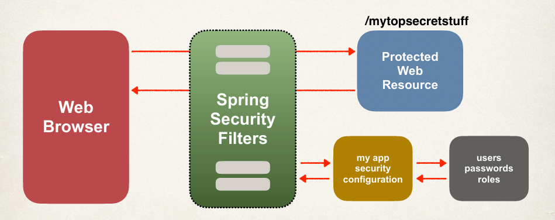
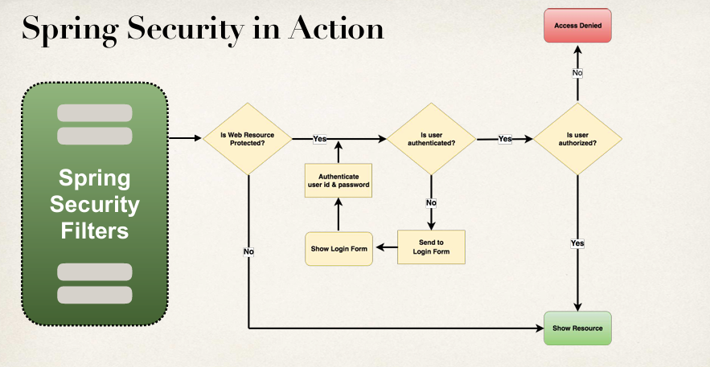

## **Spring Security Overview**

When a user uses a secured endpoint, it is first passed through the Spring Security Filter to check for **authentification**. If the user's request is authenticated, the filter allows it to access only authorised web resources.

### **Spring Security Concept in Action**

**Authentication** and **authorization** are two fundamental security concepts that control access to an application. While they are closely related, they serve different purposes.

### **1. Authentication: Verifying User Identity**  

**Authentication** is the process of verifying a user's identity by checking their credentials (such as username and password) against stored values in the application or database. It ensures that the user is who they claim to be before granting access.  

#### **How Authentication Works**  

1. **User provides credentials** (e.g., username and password) in a login form.  
2. **The system validates the credentials** by checking them against a stored database, authentication server, or external provider (e.g., OAuth, LDAP).  
3. **If valid, a session or token is issued** (e.g., JWT, session ID).  
4. **If invalid, access is denied** with an error message.  

#### **Authentication Methods:**  

- **Basic Authentication:** User provides a username and password (e.g., form-based login).  
- **Token-Based Authentication:** Uses tokens like JWT (JSON Web Token) for stateless authentication.  
- **Multi-Factor Authentication (MFA):** Requires additional verification (e.g., OTP, biometrics).  
- **OAuth/OpenID Connect:** Third-party authentication (e.g., Google, Facebook).  

### **2. Authorization: Granting or Restricting Access**  

**Authorization** determines what an authenticated user is allowed to do within the application based on their roles and permissions. It ensures that users can only access resources or perform actions that they are permitted to.  

#### **How Authorization Works**  

1. **User is authenticated** and assigned a role (e.g., `ADMIN`, `USER`).  
2. **The system checks user roles** when accessing protected resources.  
3. **If authorized, access is granted** (e.g., admin can manage users).  
4. **If unauthorized, access is denied** with a "403 Forbidden" response.  

#### **Authorization Methods:**  

- **Role-Based Access Control (RBAC):** Users are assigned roles (e.g., `ADMIN`, `USER`) that determine access.  
- **Attribute-Based Access Control (ABAC):** Access is determined based on user attributes, context, or rules.  
- **Access Control Lists (ACLs):** Specific permissions are assigned to users or groups.
